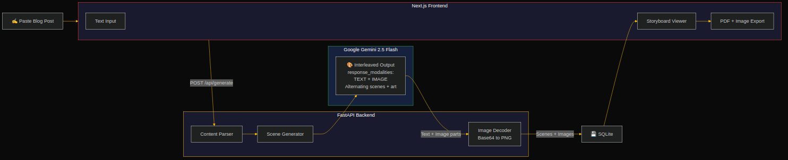

# Reelcraft

Transform any blog post or article into a cinematic video storyboard with AI-generated scene illustrations.

Powered by Google Gemini's interleaved text+image generation.

## Live Demo & Links

| | |
|---|---|
| **Live App** | [reelcraft-delta.vercel.app](https://reelcraft-delta.vercel.app) |
| **Backend API** | [reelcraft-api-93135657352.us-central1.run.app](https://reelcraft-api-93135657352.us-central1.run.app) |
| **Demo Video** | [youtu.be/OgZwbyq-U_Y](https://youtu.be/OgZwbyq-U_Y) |
| **Blog Post** | [Building Reelcraft: AI-Powered Blog-to-Video Storyboards with Gemini Interleaved Output](https://dev.to/diven_rastdus_c5af27d68f3/building-reelcraft-ai-powered-blog-to-video-storyboards-with-gemini-interleaved-output-19lf) |
| **DevPost** | [devpost.com/software/formpilot-ai-powered-form-navigator](https://devpost.com/software/formpilot-ai-powered-form-navigator) |
| **Hackathon** | Gemini Live Agent Challenge 2026 — Creative Storyteller track |

## Architecture



**Pipeline**: Paste article -> Gemini generates interleaved text scenes + illustrations -> Parse alternating parts -> Storyboard with scripts, images, and timing

## Quick Start

### Backend

```bash
cd backend
python -m venv venv && source venv/bin/activate
pip install -r requirements.txt

# Copy and fill in your Gemini API key
cp .env.example .env

uvicorn main:app --reload --port 8000
```

Without a `GEMINI_API_KEY`, the backend runs in **mock mode** with placeholder scenes and images.

### Frontend

```bash
cd frontend
npm install
npm run dev
```

Visit http://localhost:3000

## API

| Method | Path | Description |
|--------|------|-------------|
| POST | `/api/generate` | Generate a storyboard from text |
| GET | `/api/storyboards` | List all storyboards |
| GET | `/api/storyboards/{id}` | Get a specific storyboard with images |

### POST /api/generate

```json
{
  "text": "Your blog post content here...",
  "title": "Optional custom title"
}
```

Returns `{ "storyboard_id": "uuid", "message": "..." }`

## Gemini Integration

The storyboard generator uses `gemini-2.5-flash-image` with `response_modalities=['TEXT', 'IMAGE']` to generate interleaved scene scripts and illustrations in a single API call.

The response parts are parsed as alternating text blocks (scene script + timing) and inline image data (PNG illustrations).

## Cloud Deployment (IaC)

```bash
export GOOGLE_API_KEY="your-key"
export GOOGLE_CLOUD_PROJECT="your-project-id"
./deploy.sh
```

Automates: GCP API enablement, Secret Manager, Cloud Build, Cloud Run deploy, Vercel frontend deploy.

## Google Cloud Services Used

| Service | Purpose |
|---------|---------|
| Cloud Run | Backend hosting (auto-scaling, serverless) |
| Cloud Build | Container image building |
| Secret Manager | API key storage |
| Generative Language API | Gemini interleaved text+image generation |

## Environment Variables

| Variable | Default | Description |
|----------|---------|-------------|
| `GOOGLE_API_KEY` | -- | Google AI Studio API key |
| `DB_PATH` | `./reelcraft.db` | SQLite database path |
| `NEXT_PUBLIC_API_URL` | `http://localhost:8000` | Backend URL for Next.js rewrites |

## Features

- Scene-by-scene storyboard with narration scripts and timing
- AI-generated illustrations per scene (via Gemini interleaved output)
- Interactive timeline with proportional scene durations
- Export to PDF or download individual scene images
- Storyboard history with SQLite persistence
- Mock mode for development without an API key
